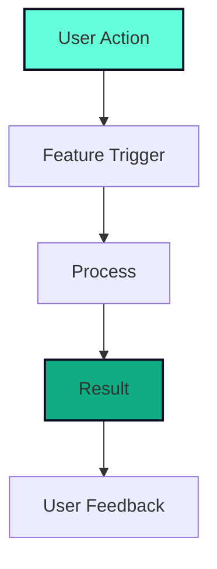

## 🎯 Feature Overview

**Is your feature request related to a problem? Please describe.**
A clear and concise description of what the problem is. Ex. I'm always frustrated when [...]

**Describe the solution you'd like**
A clear and concise description of what you want to happen.

**Describe alternatives you've considered**
A clear and concise description of any alternative solutions or features you've considered.

---

## 📋 Feature Details

### User Story
As a [type of user], I want [goal] so that [benefit].

### Acceptance Criteria
- [ ] Criterion 1: [Description]
- [ ] Criterion 2: [Description]
- [ ] Criterion 3: [Description]

### Expected Behavior
Describe the expected behavior when this feature is implemented.

### Current Behavior
Describe what currently happens (if applicable).

---

## 🎨 UI/UX Considerations

### Mockups/Wireframes
If applicable, add mockups, wireframes, or screenshots to help explain your feature.

### User Flow
Describe how users would interact with this feature:

---

## 🔧 Technical Considerations

### Implementation Approach
Describe how this feature could be implemented technically.

### Dependencies
- [ ] No new dependencies required
- [ ] Requires new library: [Library name]
- [ ] Requires backend changes
- [ ] Requires database changes

### Performance Impact
- [ ] No performance impact expected
- [ ] Minimal performance impact
- [ ] May require optimization

### Browser Compatibility
- [ ] Works on all modern browsers
- [ ] Requires specific browser features: [List features]
- [ ] May need polyfills

---

## 📊 Impact Assessment

### User Impact
- **High**: This feature would significantly improve user experience
- **Medium**: This feature would be a nice addition
- **Low**: This feature is a minor enhancement

### Priority
- [ ] 🔴 Critical - Blocks other features
- [ ] 🟠 High - Important for user experience
- [ ] 🟡 Medium - Nice to have
- [ ] 🟢 Low - Can be added later

### Complexity
- [ ] 🟢 Simple - Quick implementation
- [ ] 🟡 Medium - Moderate effort required
- [ ] 🟠 Complex - Significant development needed
- [ ] 🔴 Very Complex - Major feature requiring architecture changes

---

## 🧪 Testing Considerations

### Test Cases
- [ ] Unit tests required
- [ ] Integration tests required
- [ ] Manual testing scenarios: [Describe]

### Edge Cases
List any edge cases that should be considered:
- Edge case 1
- Edge case 2

---

## 📚 Additional Context

### Related Issues
Link to any related issues:
- Related issue #1
- Related issue #2

### References
- [ ] Similar features in other apps: [Links]
- [ ] Design inspiration: [Links]
- [ ] Technical documentation: [Links]

### Additional Information
Add any other context, screenshots, or examples about the feature request here.

---

## ✅ Checklist

Before submitting, please ensure:

- [ ] I have searched existing issues to avoid duplicates
- [ ] I have provided a clear description of the feature
- [ ] I have considered the user experience
- [ ] I have thought about technical implementation
- [ ] I have included any relevant mockups or examples
- [ ] I have checked that this aligns with the project goals

---

## 🤝 Contribution

**Are you willing to work on this feature?**
- [ ] Yes, I'd like to implement this
- [ ] Maybe, with guidance
- [ ] No, but I can help with testing/feedback

**Skills/Resources Needed:**
- [ ] Frontend development
- [ ] Backend development
- [ ] UI/UX design
- [ ] Testing
- [ ] Documentation

---

**Thank you for taking the time to suggest this feature! 🎉**
