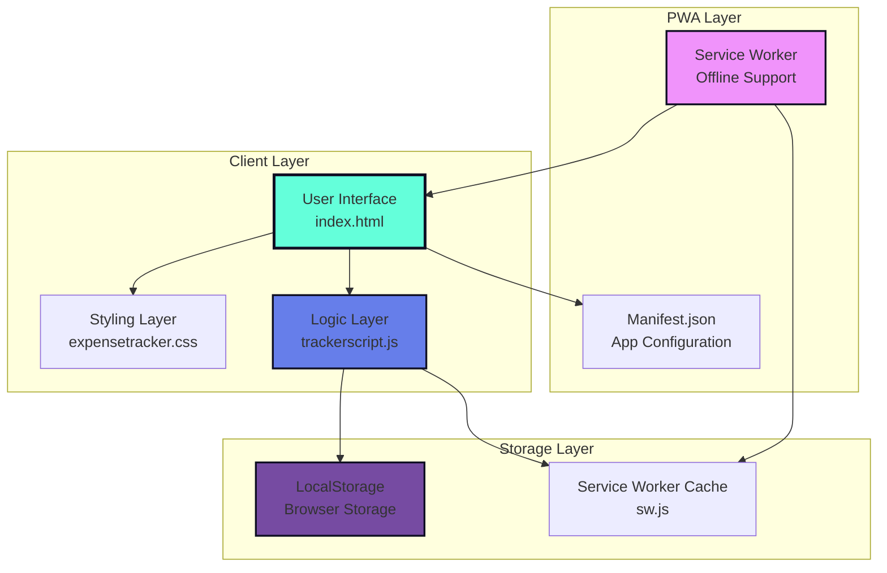
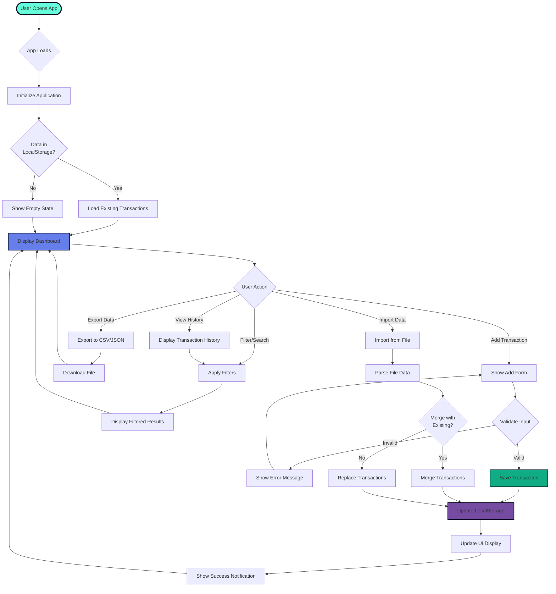
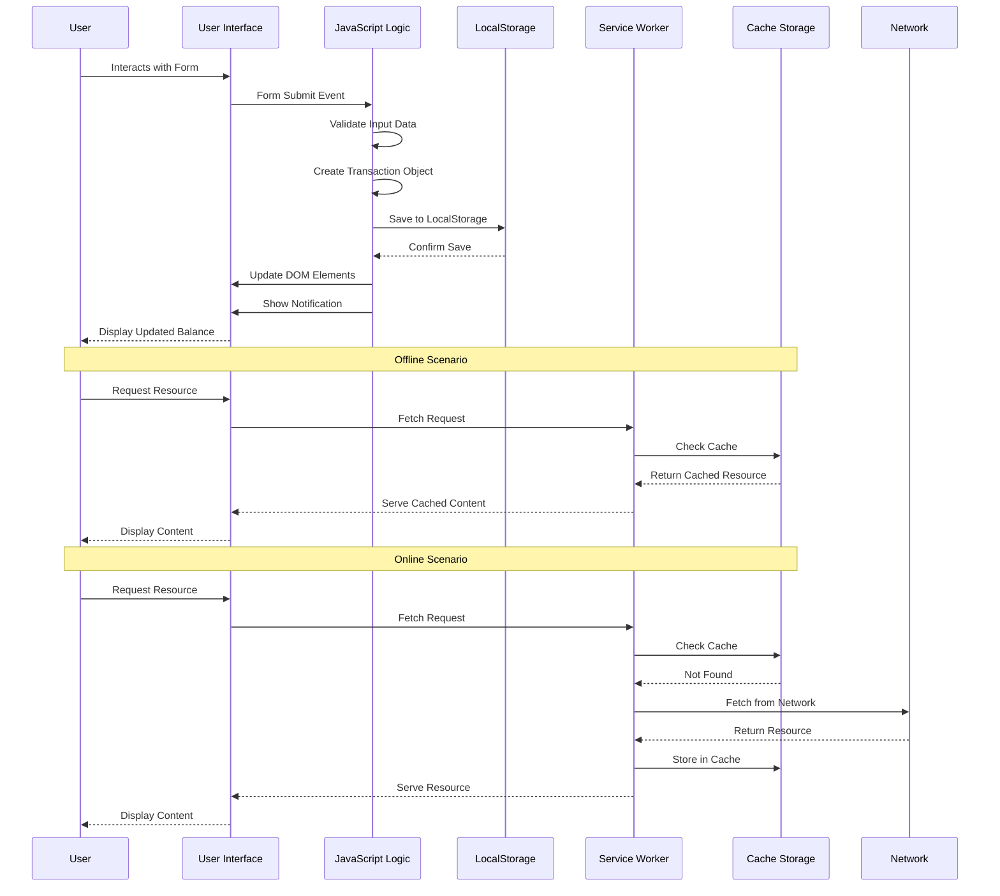
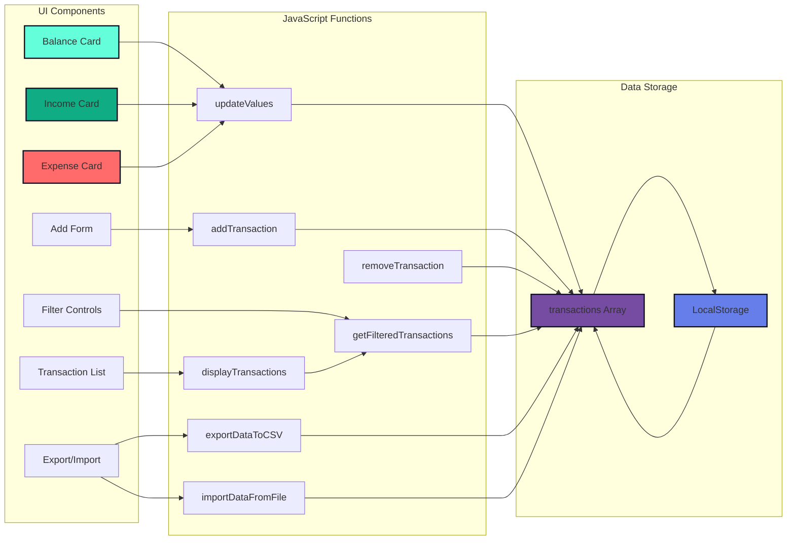
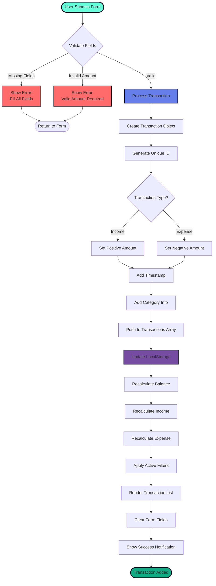
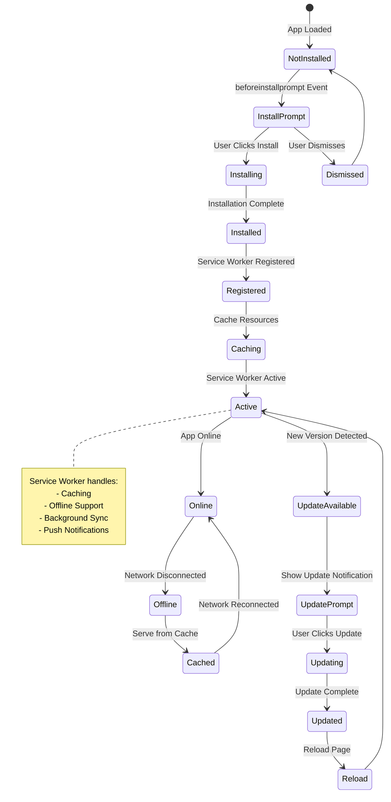
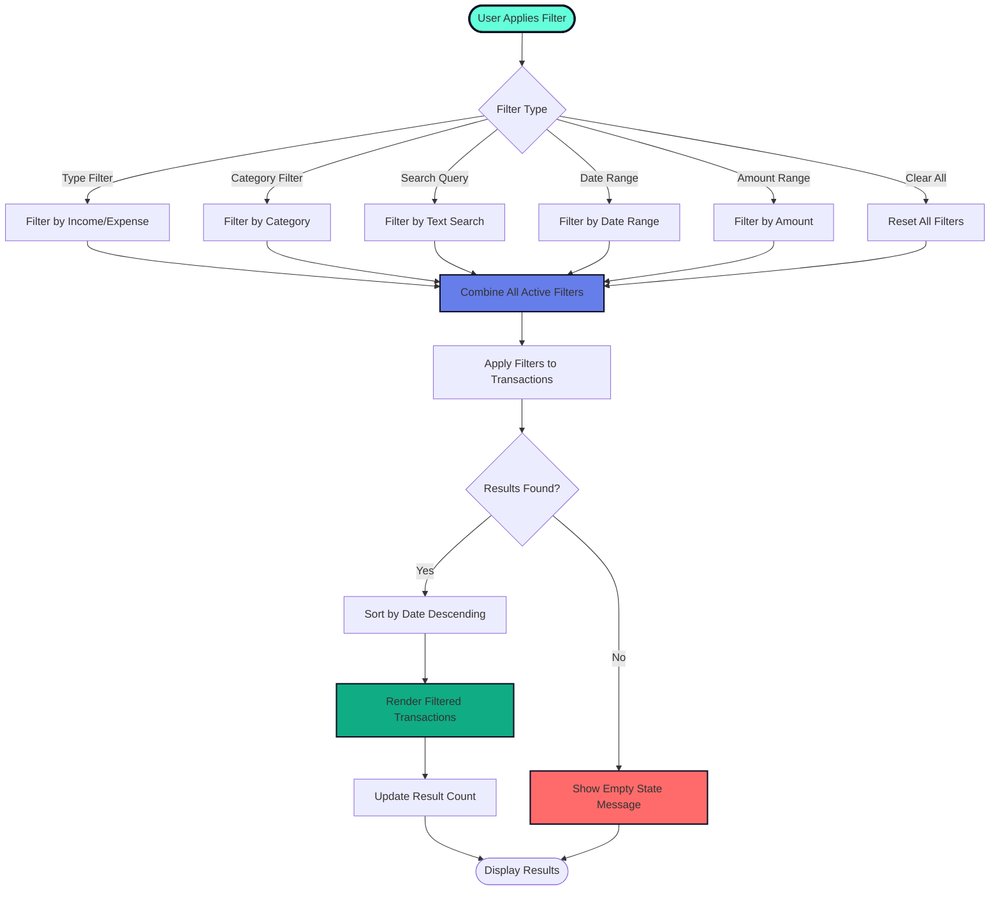
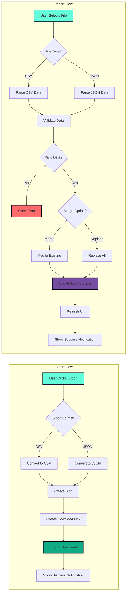
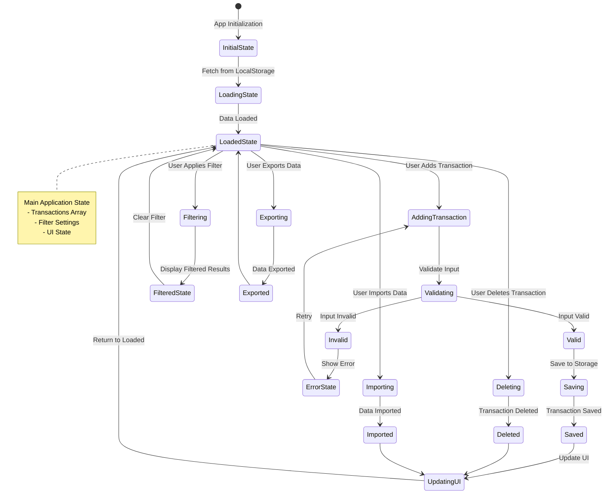

# 💸 ExpenseFlow – Smart Expense Tracker  

**ExpenseFlow** is a modern and responsive **expense tracking web application** designed to help users manage their finances efficiently.  
With a clean and elegant dark-themed UI, it allows users to monitor spending, analyze balance, and achieve their financial goals effortlessly.  

---

## 🧭 Table of Contents
- [✨ Features](#-features)
- [🖥️ Overview](#️-overview)
- [🏗️ Architecture & Flowcharts](#️-architecture--flowcharts)
- [🛠️ Tech Stack](#️-tech-stack)
- [📂 Folder Structure](#-folder-structure)
- [🚀 Getting Started](#-getting-started)
- [📖 Usage Guide](#-usage-guide)
- [🔄 Data Flow](#-data-flow)
- [📸 Screenshots](#-screenshots)
- [🧩 Future Enhancements](#-future-enhancements)
- [🎯 Learning Outcomes](#-learning-outcomes)
- [🤝 Contributing](#-contributing)
- [🧾 License](#-license)
- [👩‍💻 Author](#-author)
- [💬 Quote](#-quote)

---

## ✨ Features

- 📊 **Smart Dashboard** – Displays total balance, spending trends, and updates.  
- 💰 **Expense & Income Management** – Add, edit, or remove transactions easily.  
- 🎯 **Goal Tracking** – Set saving targets and measure progress.  
- 📈 **Analytics View** – Track your financial health visually.  
- 🌙 **Dark Mode UI** – Sleek and eye-comfortable dark theme.  
- ⚙️ **Responsive Design** – Optimized for desktop and mobile devices.  
- 🔐 **PWA Ready** – Manifest and service worker support for offline usage.  
- 🔍 **Advanced Filtering** – Filter by category, date range, amount, and search.  
- 📥 **Data Import/Export** – Export to CSV/JSON and import your data.  
- 🔔 **Real-time Notifications** – Get instant feedback on your actions.  

---

## 🖥️ Overview

ExpenseFlow focuses purely on the **frontend development** aspect of an expense tracker app.  
It is an ideal beginner-to-intermediate project to learn how to build and design **interactive, data-driven interfaces** using HTML, CSS, and JavaScript.  

The app emphasizes:
- User-centered design  
- Visual representation of financial data  
- Scalable project structure for future backend integration  
- Progressive Web App (PWA) capabilities for offline functionality

---

## 🏗️ Architecture & Flowcharts

### 📐 Application Architecture



### 🔄 User Journey Flow



### 💾 Data Flow Architecture



### 🧩 Component Interaction Flow



### 🔄 Transaction Processing Flow



### 📱 PWA Lifecycle Flow



### 🔍 Filtering & Search Flow



### 📥 Export/Import Data Flow



### 🎨 State Management Flow



---

## 🛠️ Tech Stack

| Category | Technology Used |
|-----------|------------------|
| **Frontend** | HTML5, CSS3, JavaScript (Vanilla JS) |
| **Styling** | Custom CSS with CSS Variables |
| **Icons** | Font Awesome 6.4.0 |
| **Fonts** | Google Fonts (Inter) |
| **Storage** | LocalStorage API |
| **PWA** | Service Workers, Web App Manifest |
| **Version Control** | Git, GitHub |
| **Deployment** | GitHub Pages |

---

## 📂 Folder Structure

```
ExpenseFlow/
│
├── index.html              # Main HTML layout
├── expensetracker.css      # Styling and UI components
├── trackerscript.js       # Core JavaScript functionality
├── manifest.json           # PWA Manifest file
├── sw.js                   # Service Worker for offline caching
├── LICENSE                 # MIT License
├── README.md               # Project documentation
├── CONTRIBUTING.md         # Contribution guidelines
├── Code_of_conduct.md      # Code of conduct
└── .github/
    └── ISSUE_TEMPLATE/
        └── feature_request.md  # Feature request template
```

---

## 🚀 Getting Started

### Prerequisites

- A modern web browser (Chrome, Firefox, Safari, Edge)
- A code editor (VS Code, Sublime Text, etc.)
- Git (optional, for version control)

### Installation

Follow these simple steps to set up and view the project on your local machine:

#### 1️⃣ Clone the Repository

```bash
git clone https://github.com/Renu-code123/ExpenseFlow-expensetracker.git
```

#### 2️⃣ Navigate into the Project Folder

```bash
cd ExpenseFlow-expensetracker
```

#### 3️⃣ Open the Application

**Option A: Direct Browser Opening**
- Simply open the `index.html` file in your browser.

**Option B: Using Live Server (Recommended)**

```bash
# Using npx (no installation needed)
npx live-server

# Or install globally
npm install -g live-server
live-server
```

The application will automatically open in your default browser at `http://localhost:8080`

#### 4️⃣ PWA Installation (Optional)

1. Open the application in a supported browser
2. Look for the install prompt or browser's install option
3. Click "Install" to add ExpenseFlow to your home screen
4. Enjoy offline functionality!

---

## 📖 Usage Guide

### Adding a Transaction

1. Scroll to the "Add New Transaction" section
2. Fill in the transaction details:
   - **Description**: Enter a brief description (e.g., "Grocery Shopping")
   - **Category**: Select from available categories
   - **Amount**: Enter the transaction amount
   - **Type**: Select "Income" or "Expense"
3. Click "Add Transaction"
4. The transaction will appear in your history and update your balance

### Filtering Transactions

- **Type Filter**: Click "All", "Income", or "Expense" buttons
- **Category Filter**: Select a category from the dropdown
- **Search**: Type in the search box to find specific transactions
- **Date Range**: Select "From" and "To" dates
- **Amount Range**: Enter minimum and maximum amounts
- **Clear Filters**: Click "Clear Filters" to reset all filters

### Exporting Data

1. Scroll to the "Data Management" section
2. Click "Export to CSV" or "Export to JSON"
3. The file will download automatically
4. Use this file for backup or analysis in spreadsheet applications

### Importing Data

1. Scroll to the "Data Management" section
2. Click "Choose File" and select a CSV or JSON file
3. Choose whether to merge with existing data or replace it
4. Click "Import Data"
5. Your transactions will be imported and displayed

### Deleting Transactions

- Click the trash icon (🗑️) next to any transaction
- The transaction will be removed and your balance will update

---

## 🔄 Data Flow

### Transaction Data Structure

```javascript
{
  id: 123456789,              // Unique identifier
  text: "Grocery Shopping",   // Transaction description
  amount: -2500.00,          // Amount (negative for expenses)
  category: "food",          // Category key
  type: "expense",           // Transaction type
  date: "2025-01-15T10:30:00.000Z"  // ISO timestamp
}
```

### Storage Flow

```mermaid
graph LR
    A[User Input] --> B[Form Validation]
    B --> C[Create Transaction Object]
    C --> D[Add to Transactions Array]
    D --> E[Stringify to JSON]
    E --> F[Save to LocalStorage]
    F --> G[Update UI]
    G --> H[Display Notification]
    
    style A fill:#64ffda,stroke:#0f0f23,stroke-width:2px
    style D fill:#667eea,stroke:#0f0f23,stroke-width:2px
    style F fill:#764ba2,stroke:#0f0f23,stroke-width:2px
    style G fill:#10ac84,stroke:#0f0f23,stroke-width:2px
```



---

## 📸 Screenshots

### 🏠 Dashboard Preview  
**Smart Money Management – Take control of your finances with our intuitive expense tracker.**

*Note: Add your screenshots here to showcase the application*

---

## 🧩 Future Enhancements

- 🔗 **Backend Integration** – Add backend for real-time data persistence (Firebase or Node.js)  
- 📊 **Advanced Charts** – Integrate charting tools like Chart.js for expense visualization  
- 🔐 **Authentication** – Introduce login/authentication system  
- 💡 **Budget Management** – Add budget limits and alerts for categories  
- 📱 **Mobile App** – Native mobile app using React Native or Flutter  
- 🌍 **Multi-currency Support** – Support for multiple currencies  
- 📧 **Email Reports** – Weekly/monthly expense reports via email  
- 🤖 **AI Insights** – AI-powered spending insights and recommendations  
- 🔔 **Push Notifications** – Reminders for bill payments and budget limits  
- 📈 **Investment Tracking** – Track investments and portfolio performance  

---

## 🎯 Learning Outcomes

By building this project, you'll learn:

- 🎨 **Responsive UI Design** – Creating beautiful, responsive interfaces using CSS  
- 🧠 **DOM Manipulation** – Working with the Document Object Model using vanilla JavaScript  
- 📂 **Data Management** – Managing and displaying dynamic user data  
- 💾 **Local Storage** – Persisting data using the LocalStorage API  
- ⚙️ **PWA Development** – Working with manifests and service workers  
- 🏗️ **Project Structure** – Structuring a scalable frontend project  
- 🔄 **State Management** – Managing application state without frameworks  
- 🎯 **Event Handling** – Handling user interactions and events  
- 📊 **Data Visualization** – Displaying financial data in an intuitive way  
- 🧪 **Error Handling** – Implementing proper error handling and validation  

---

## 🤝 Contributing

Contributions are always welcome!  
If you'd like to improve **ExpenseFlow**, follow these steps:

1. **Fork the repository**  
2. **Create a new branch**
   ```bash
   git checkout -b feature-name
   ```
3. **Commit your changes**
   ```bash
   git commit -m "Added a new feature"
   ```
4. **Push to your branch**
   ```bash
   git push origin feature-name
   ```
5. **Open a Pull Request**

For detailed contribution guidelines, please read [CONTRIBUTING.md](./CONTRIBUTING.md)

---

## 🧾 License  
This project is licensed under the **MIT License** – see the [LICENSE](./LICENSE) file for details.  

---

## 👩‍💻 Author  
**Renu Kumari Prajapati**  
🎓 Information Technology Student | 💻 Frontend Developer | 🌍 Open Source Enthusiast  

📫 **Connect with me:**  
- **GitHub:** [@Renu-code123](https://github.com/Renu-code123)

---

## 💬 Quote  
> "Smart money management begins with awareness — track it, plan it, and grow it with **ExpenseFlow**."  

---

## 🌟 Show Some Love  
If you found this project useful, don't forget to ⭐ **Star** the repository!  
Let's build smarter tools for financial awareness together 💜

---

## 📊 Project Statistics

- 📁 **Total Files**: 8
- 💻 **Lines of Code**: ~2,500+
- 🎨 **CSS Classes**: 100+
- ⚡ **JavaScript Functions**: 30+
- 📱 **PWA Ready**: ✅
- 🌐 **Browser Support**: All modern browsers
- 📦 **Dependencies**: Zero (Vanilla JS)

---

## 🐛 Known Issues

- Service Worker caching may require hard refresh on updates
- Large transaction lists (>1000) may experience performance issues
- Date filters use local timezone (UTC conversion coming soon)

---

## 🔗 Related Projects

- [Expense Tracker API](https://github.com/example/expense-api) - Backend API for ExpenseFlow
- [ExpenseFlow Mobile](https://github.com/example/expenseflow-mobile) - Mobile app version

---

## 📞 Support

If you encounter any issues or have questions:

1. Check the [Issues](https://github.com/Renu-code123/ExpenseFlow-expensetracker/issues) page
2. Read the [Documentation](./CONTRIBUTING.md)
3. Create a new issue with detailed information

---

**Made with ❤️ for better financial management**